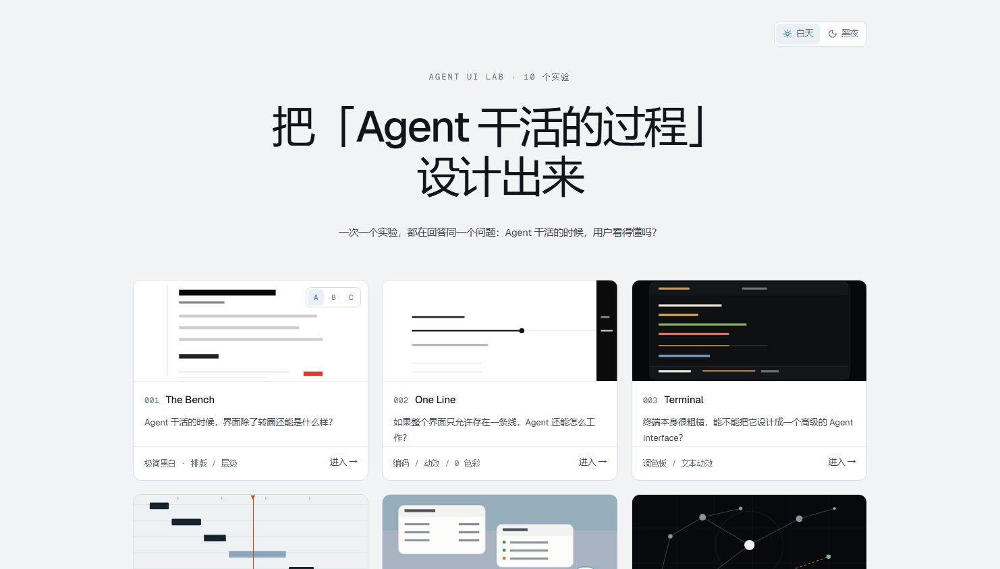

<h1 align="center">Agent UI Lab</h1>

<p align="center">
  <a href="./README.md">简体中文</a> | <b>English</b>
  <br><br>
  <a href="https://chenchen913.github.io/agent-ui-lab/"><b>▶ Live demo</b></a>
  &nbsp;·&nbsp;
  <a href="https://github.com/ChenChen913/agent-ui-lab">Source</a>
  <br>
  <a href="LICENSE"></a>
</p>

Fifteen standalone interface experiments on how an AI agent's work should look.

**Live: <https://chenchen913.github.io/agent-ui-lab/>** — every push to `main` redeploys it. To run it locally, see [Quick start](#quick-start).



## Table of contents

- [Why this project](#why-this-project)
- [Quick start](#quick-start)
- [The two lines](#the-two-lines)
- [Usage](#usage)
- [Configuration](#configuration)
- [Project structure](#project-structure)
- [Development](#development)
- [How an experiment is made](#how-an-experiment-is-made)
- [FAQ](#faq)
- [Known limitations](#known-limitations)
- [Contributing](#contributing)
- [License](#license)

## Why this project

Almost every AI product looks the same: a list of past conversations on the left, a wall of chat in the middle, an input box at the bottom. What the agent is actually doing, how far along it is, and whether it did what you asked all get buried in a stream of messages.

This project starts from one line:

> **Less architecture, more experiments. Less infrastructure, more interface. Less consistency, more divergence.**

So there is no component library, no design system, no SDK, and no agent runtime here. Each of the fifteen templates is a standalone interface with its own colors, type, and layout. They never import each other, and not a single line of CSS is shared. The one exception is [`src/shared/beat.ts`](#project-structure), which holds plumbing rather than looks.

The project has two lines, each answering one question:

> **A · Agent product UI — how should a person actually use an agent?**
> **B · Agent process visualisation — when an agent is working, how do you let the user understand it?**

The gallery is split by these two lines. Every template belongs to exactly one, and each line is numbered from 1.

## Quick start

**The quickest way in is the live demo: <https://chenchen913.github.io/agent-ui-lab/>**

To change the code locally, you need Node.js 20 or newer and pnpm.

Tested on Node.js v24.21.0 and pnpm 11.7.0.

```sh
git clone https://github.com/ChenChen913/agent-ui-lab.git
cd agent-ui-lab
pnpm install
pnpm dev
```

Open the address printed in the terminal (http://localhost:5273 by default). You land on the gallery page.

## The two lines

The project has two lines. **Line A sits on top, line B below; every template belongs to exactly one, and each line is numbered from 1.**

### A · Agent product UI

> How should a person actually use an agent?

Moving from "what is the agent doing" to "how does a person work with it". This line covers the product entry point, task creation, commission and negotiation, artifacts, and the ongoing interaction between a person and an agent.

| No. | Name | The question it answers |
|---|---|---|
| 1 | The Brief | What if the interface were about the commission, not the chat log? |
| 2 | Baseline | What should the layer a user sees right after signing in actually look like? |
| 3 | Workbench | What if the output were not the last message but an artifact sitting next to the chat? |
| 4 | Home | What if the home screen were the product itself, with the input floating in the center? |
| 5 | Bubble | What if the agent looked like the chat app you already know by heart? |
| 6 | The Plan | The agent already started, and you realise it misunderstood. What now, besides killing it? |
| 7 | Weight | Should one screen give the same amount of process for one sentence and for twenty projects? |
| 8 | Settle | Are the process and the result two things, or two stages of one thing? |
| 9 | Return | The user was away for 20 minutes. What should they see when they come back? |

### B · Agent process visualisation

> When an agent is working, how do you let the user understand it?

Conventional products compress an agent's work into one spinner. This line asks what else that whole process could be. **The six templates are six deliberately un-unified visual languages.**

| No. | Name | The question it answers |
|---|---|---|
| 1 | The Bench | When an agent is working, what can the interface be besides a spinner? |
| 2 | One Line | If the whole interface were allowed exactly one line, how could an agent still work? |
| 3 | Terminal | Terminals are crude. Can one be designed into a first-class agent interface? |
| 4 | Chronicle | What if an agent's work were shown as a timeline instead of a chat log? |
| 5 | Desktop | What if an agent were not a web page but something that lives on your desktop? |
| 6 | Spatial | What if an agent's state were expressed through spatial relationships instead of a list? |

## Usage

The gallery lives at `/`. Every experiment has its own route:

```
/            Gallery, the entry point for all fifteen
/001/a      001 has three skins at /001/a, /001/b and /001/c
/002 … /015 The rest
```

Each experiment page has a control bar in the top right: back to the gallery, previous and next experiment, light and dark toggle, play and pause, restart, and speed (0.5x, 1x, 2x).

**Every experiment is operable, not just viewable.** You can type into the inputs, click the buttons, drag and zoom the canvas in 006, and rewrite a step in place in 012. The scripted demo is only one of several paths through it, and it stops on its own once the script runs out instead of idling in the background.

## Configuration

**This project needs no API keys and no environment variables for you to fill in.**

Command: `Get-ChildItem -Path src -Recurse -Include *.ts,*.tsx | Select-String -Pattern 'import\.meta\.env|process\.env'` returns 1 match: `import.meta.env.BASE_URL` in `src/lab/previews.tsx`.

That is a Vite build constant, used to point preview images at the right GitHub Pages subpath. Nothing to configure.

> Correction: this used to say 0 matches. The old command relied on `Select-String -Path 'src\**\*.ts'`, and PowerShell does not expand `**` into a recursive walk from `-Path`. It was a false negative. `-Recurse` tells the truth.

All data is mock data hard-coded in `src/experiments/*/scenario.ts`.

## Project structure

```
src/
├── experiments/          Fifteen templates, one folder each, self-contained
│   ├── 001-bench/        scenario / engine / index / style.css / NOTES.md
│   └── …
├── lab/                  The lab shell
│   ├── Index.tsx         Gallery page
│   ├── Frame.tsx         Top bar and playback controls for experiment pages
│   ├── previews.tsx      One schematic per experiment on the gallery page
│   ├── registry.ts       Experiment list and route table
│   └── theme.ts          Light and dark
├── shared/               The only place reuse is allowed
│   └── beat.ts           Demo beat engine, used by 008 through 015
└── styles/               Global styles and shell color tokens
docs/                     Screenshots used by the README
```

Each experiment ships as its own chunk. Opening one downloads only that one, so the first screen does not carry the weight of the other fourteen.
docs/                     Screenshots used by the README
```

## Development

```sh
pnpm dev         # Dev server
pnpm typecheck   # Type check (tsc --noEmit)
pnpm build       # Production build
pnpm preview     # Preview the build output
```

No test framework is configured.

## How an experiment is made

Every experiment follows the same path, in this order:

1. **Concept**: decide the **one question** this experiment answers. If the question cannot be written down, no code gets written
2. **Interaction**: which interactions does that viewpoint imply? Which of them belong to this viewpoint alone?
3. **Visual Design**: the visual language derives from the viewpoint, never inherited from another experiment
4. **Implementation**: one folder, complete, with the full interface, mock data, state changes, and loading, done, and error states

Every experiment has to be genuinely clickable. A still image is not enough, and neither is a looping animation.

Since 002, all animation follows one pattern: **the per-frame loop only writes CSS variables and DOM styles, and React re-renders only on discrete beats**. A demo running tens of seconds usually triggers only tens of re-renders.

## FAQ

**Q: Why does every experiment write its own styles instead of sharing?**

A: Sharing would slowly make all fifteen look alike, and that destroys the point of comparing them. So not a single line of CSS is shared.

The one exception is `src/shared/beat.ts`. The demo beat loop in 008 through 015 had been copied verbatim six times — advancing time, interpolating the typewriter, clearing timers, byte for byte identical each time. It is pure plumbing with no bearing on appearance, so extracting it changes nobody's looks. It also means one fix lands eight times over: "stop when the script is done" went from missing in eight places to correct in one.

**Q: Can I wire this up to a real LLM?**

A: No, and there is no plan to. This project studies interfaces. Adding a model would only pull attention away from layout and interaction.

**Q: Why do 008 through 015 open almost empty?**

A: That is not unfinished work, it is a deliberate first frame: the moment a user opens the product and has not yet handed over a task. Press play in the top right for the full demo, or just start using it — the inputs in these experiments all work.

001 through 007 autoplay instead, because the process itself is what they are studying.

## Known limitations

- All data is mock. There is no real model call, no backend, no database, and no login
- Desktop is the primary viewport. Mobile gets breakpoint handling, and every stylesheet ships a `prefers-reduced-motion` fallback, but no design has been done specifically for phones
- No automated tests. CI only runs `pnpm build` and deploys to GitHub Pages (`.github/workflows/deploy.yml`)
- The terminal in 003 implements only the few commands the demo needs (`clear`, Ctrl-C, and so on)
- The live build uses hash routing, so a template URL looks like `https://chenchen913.github.io/agent-ui-lab/#/008`
- Clauses in 007 cannot be edited in place, only rewritten by answering
- Undo in 014 restores a source wholesale; it cannot remove a single step

## Contributing

Issues and pull requests are welcome, especially new experiment ideas. Ask questions in [Issues](https://github.com/ChenChen913/agent-ui-lab/issues).

If you want to add an experiment, include its `NOTES.md` and state clearly the one question it answers.

## License

[MIT](LICENSE) © 2026 ChenChen913

Free to use, modify, and distribute, including commercially and in closed-source projects, as long as the copyright notice is kept.
